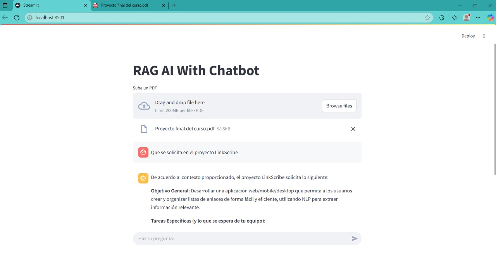
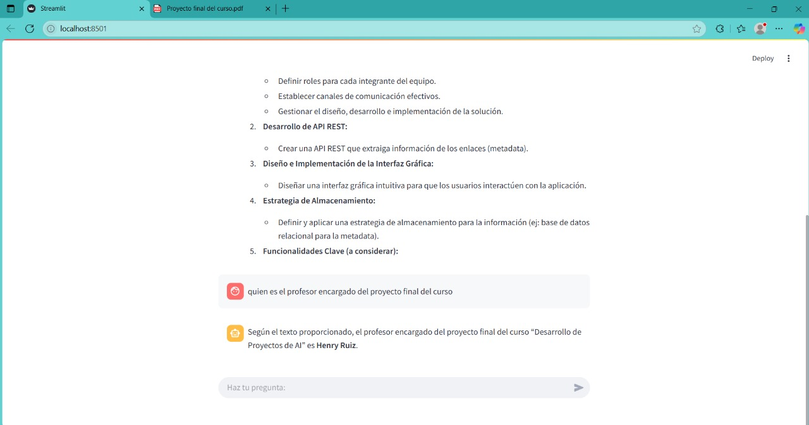

# RAG CHATBOT PDF

Este aplicativo genera un proyecto en `Streamlit` con la técnica `RAG` a través de la carga de PDF's.

## Instrucciones de ejecución

Se asume que se cuenta con la instalación de `ollama` y que se cuenta con los modelos solicitados en la actividad instalados: `nomic-embed-text`.

```bash
# Crear el archivo de variables de entorno .env
touch .env # MAC
notepad .env # Windows

# Agregar las variables de entorno de LangSmith para el Tracing
# y la selección del modelo
LANGSMITH_TRACING='true' # Colocar false en caso de no desear hacer Tracing
LANGSMITH_API_KEY='<api-key-langsmith>'
CHAT_MODEL='<modelo-instalado-con-ollama>'

# Instalar paquetes
uv pip install -r pyproject.toml

# Ejecutar aplicación con streamlit
streamlit run app.py
```

Al cargar, se debe subir un archivo PDF, y posteriormente hacer preguntas con respecto a ese PDF.

## Ejemplos de consultas




